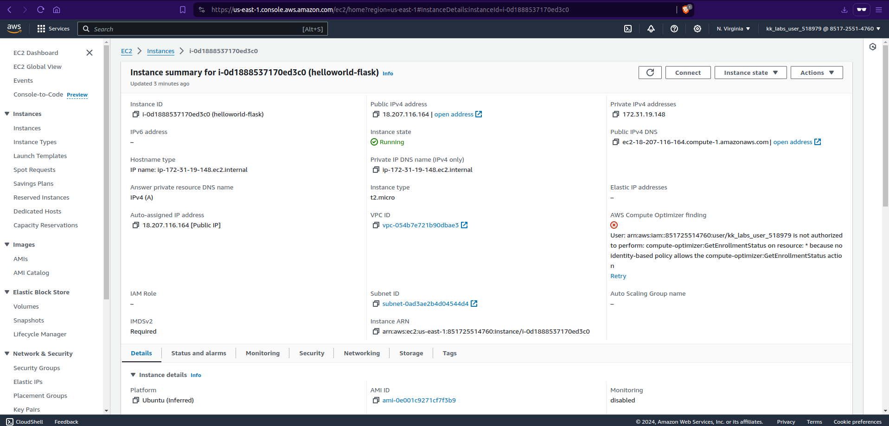
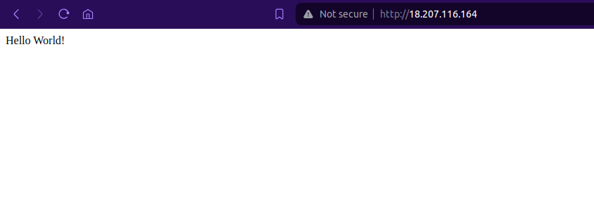
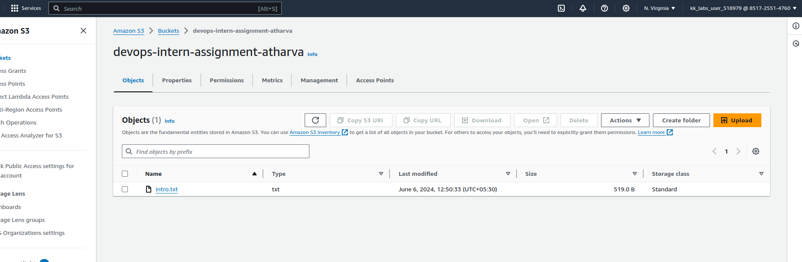
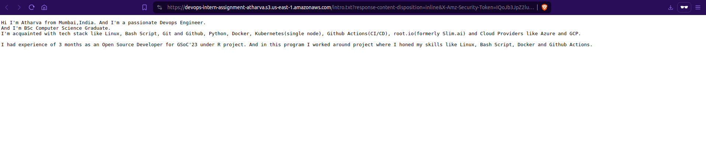

# EC2 creation 

Steps: 
1. Created EC2 with options Ubuntu22.04, t2.micro and enabled ssh,http and https security group options.

2. Then connected to the ec2 instance using ssh key(pem file).


# Run Flask App on AWS EC2 Instance
Install Python Virtualenv
```bash
sudo apt-get update
sudo apt-get install python3-venv
```
Activate the new virtual environment in a new directory

Create directory
```bash
git clone https://github.com/StarTrooper08/devops-assignment.git
cd devops-assignment
```
Create the virtual environment
```bash
python3 -m venv venv
```
Activate the virtual environment
```bash
source ./venv/bin/activate
```
Install Flask
```bash
pip install Flask
```
Create a Simple Flask API
```bash
sudo vi app.py
```
```bash
from flask import Flask

app = Flask(__name__)

@app.route('/')
def hello_world():
	return 'Hello World!'

if __name__ == "__main__":
	app.run()
```
Verify if it works by running 
```bash
python app.py
```

Gunicorn WSGI server to serve the Flask Application

Install Gunicorn using the below command:
```bash
pip install gunicorn
```
Run Gunicorn:
```bash
gunicorn -b 0.0.0.0:8000 app:app 
```
Gunicorn is running (Ctrl + C to exit gunicorn)!

```bash
pip freeze > requirements.txt
```
Added the libs in req file for future convenience and removed the other dep except Flask and gunicorn for better simplicity.


Use systemd to manage Gunicorn
Systemd is a boot manager for Linux. We are using it to restart gunicorn if the EC2 restarts or reboots for some reason.

	
```bash
sudo nano /etc/systemd/system/helloworld.service
```
Then add this into the file.
```bash
[Unit]
Description=Gunicorn instance for a simple hello world app
After=network.target
[Service]
User=ubuntu
Group=www-data
WorkingDirectory=/home/ubuntu/devops-assignment
ExecStart=/home/ubuntu/devops-assignment/venv/bin/gunicorn -b localhost:8000 app:app
Restart=always
[Install]
WantedBy=multi-user.target
```
Then enable the service:
```bash
sudo systemctl daemon-reload
sudo systemctl start helloworld
sudo systemctl enable helloworld
```
Check if the app is running with 
```bash
curl localhost:8000
```


Run Nginx Webserver to accept and route request to Gunicorn
Finally, we set up Nginx as a reverse-proxy to accept the requests from the user and route it to gunicorn.

Install Nginx 
```bash
sudo apt-get nginx
```
Start the Nginx service and go to the Public IP address of your EC2 on the browser to see the default nginx landing page
```bash
sudo systemctl start nginx
sudo systemctl enable nginx
```
Edit the default file in the sites-available folder.
```bash
sudo nano /etc/nginx/sites-available/default
```
Add the following code at the top of the file (below the default comments)
```bash
server {
    listen 80;

    server_name 18.207.116.164;

    location / {
        proxy_pass http://127.0.0.1:8000;
        proxy_set_header Host $host;
        proxy_set_header X-Real-IP $remote_addr;
        proxy_set_header X-Forwarded-For $proxy_add_x_forwarded_for;
        proxy_set_header X-Forwarded-Proto $scheme;
    }
}


```
Restart Nginx 
```bash
sudo systemctl restart nginx
```
Tada! Our application is up!




#S3 bucket file upload


